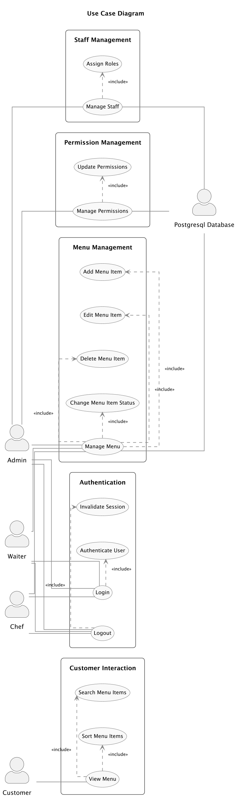

# Use Case Diagram

## Use Case Diagram

**Annotations:**
- 要件定義書の内容に基づき、以下の活動フローを説明します。

---

### アクター: 役割と責任
- **顧客 (Customer)**: レストランのメニューを閲覧し、料理名で検索や並び替えを行う。
- **管理者 (Admin)**: メニュー管理、スタッフ管理、権限管理を行い、システム全体を統括。
- **ウェイター (Waiter)**: メニューの説明や画像を編集する権限を持つ。
- **シェフ (Chef)**: メニューの作成、編集、削除、状態変更を行い、料理の提供状況を管理。
- **外部システム (PostgreSQL Database)**: メニュー、スタッフ、権限などのデータを保存し、APIバックエンドを通じてアクセスされる。

---

### 主なユースケース: 目的、主な流れ、拡張機能
#### **1. メニュー閲覧 (View Menu)**
- **目的**: 顧客が料理リストを閲覧し、検索や並び替えを行う。
- **主な流れ**: 顧客は公開メニュー画面にアクセスし、料理名で検索や価格順で並び替えを行う。
- **拡張機能**: メニューの状態（available、limited、sold_out）がリアルタイムで反映される。

#### **2. メニュー管理 (Manage Menu)**
- **目的**: 管理者、ウェイター、シェフが料理情報を管理する。
- **主な流れ**: 
  - 管理者、ウェイター、シェフがログイン。
  - メニュー項目の作成、編集、削除、状態変更を実行。
  - 一括状態変更機能で複数の料理を効率的に更新。
- **拡張機能**: 画像のアップロード、更新、削除。

#### **3. スタッフ管理 (Manage Staff)**
- **目的**: 管理者が内部ユーザーアカウントを管理する。
- **主な流れ**: 
  - 管理者がスタッフの閲覧、作成、編集、削除を行う。
  - 役割を割り当て、複数役割を同時に付与可能。
- **拡張機能**: 役割の競合が発生した場合、上位権限が優先される。

#### **4. 権限管理 (Manage Permissions)**
- **目的**: 管理者が役割と権限を管理する。
- **主な流れ**: 
  - 管理者が役割の作成、編集、削除を行い、権限を設定。
  - デフォルト役割（Admin、Waiter、Chef）は削除不可。
- **拡張機能**: カスタム役割の作成と編集。

#### **5. ログイン (Login)**
- **目的**: 内部ユーザーがシステムにアクセスする。
- **主な流れ**: 
  - ユーザーがメールアドレスとパスワードを入力。
  - 認証成功後、JWTトークンが発行され、権限に応じた機能にアクセス。
- **拡張機能**: トークンの有効期限が切れた場合、自動再認証。

#### **6. ログアウト (Logout)**
- **目的**: 内部ユーザーがセッションを終了する。
- **主な流れ**: 
  - ユーザーがログアウト操作を実行。
  - セッションが無効化され、認証トークンが削除。
- **拡張機能**: ログアウト後、自動的にログイン画面へリダイレクト。

---

### 関係性とフロー: サービス/モジュールの高レベルな相互作用
- **顧客と公開メニュー画面**: 顧客はログイン不要でメニューを閲覧し、検索や並び替えを行う。
- **内部ユーザーと管理アプリケーション**: 管理者、ウェイター、シェフはログイン後、メニュー管理、スタッフ管理、権限管理を実行。
- **APIバックエンドとPostgreSQLデータベース**: APIバックエンドはデータベースにアクセスし、料理情報やユーザー情報を取得・更新。
- **認証サービスと内部ユーザー**: 認証サービスはJWTトークンを発行し、APIバックエンドで権限を検証。

---

### 注意事項: 条件、制約、ビジネスルール
- **認証とセキュリティ**: JWT/OAuth2を採用し、パスワードはbcryptでハッシュ化。トークンの有効期限は1日。
- **権限管理**: RBACモデルに基づき、各APIエンドポイントで権限を確認。デフォルト役割は削除不可。
- **データのリアルタイム性**: メニューの状態変更は即座に顧客向け画面に反映。
- **エラー処理**: 4xx/5xxエラーはログに記録され、ユーザーには簡潔なメッセージを表示。
- **拡張性**: モジュール化されたアーキテクチャにより、新機能の追加が容易。

---
